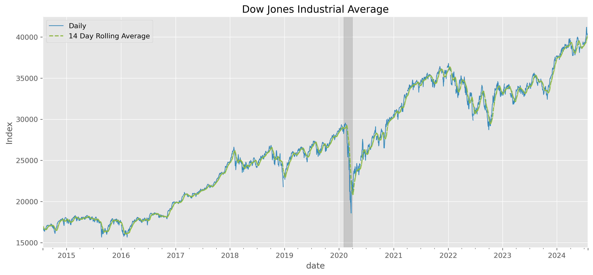
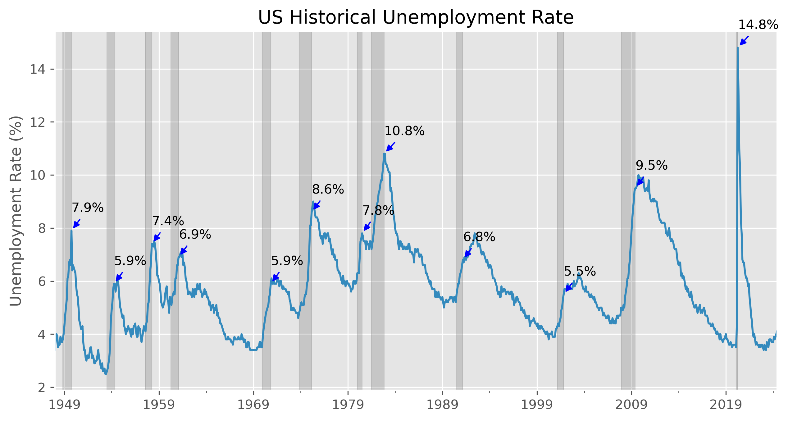
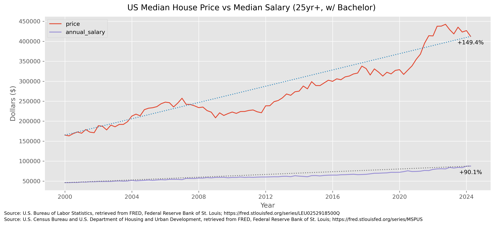

# FRED_Exploration-Python
Federal Reserve Economic Data (FRED) is a database maintained by the Research division of the Federal Reserve Bank of St. Louis that has economic time series data for various topics such as unemployment, housing, and salary.  The objective of this project is to use pandas to explore data sets that look interesting and extract any insights!

The dataset is pulled directly from FRED's API using Python.  The data is wrangled, cleaned, and analyzed using Python pandas; visualization is done using pandas, matplotlib, or seaborn all within a Jupyter notebook.

Below are the some of the main analysis and visualization pursued in this project!

## Dow Jones Daily Average vs 14 Day Rolling Average

- The grey bar is the recession caused by COVID-19

## Historical Unemployment Rate

- The recession caused by COVID-19 has the highest peak unployment rate however it is also the shortest in duration

## Unemployment Rate vs Participation Rate

## Housing vs Salary
- Median Housing Price has gone up +150% versus Median Salary of individuals over 25 years old and have a Bachelor's degree has only increased +90% since year 2000!

### Check out the Jupyter Notebook [here](https://github.com/ChrisEvangelista1/FRED_Exploration-Python/blob/main/FRED%20Economic%20Data%20Analysis.ipynb)!
